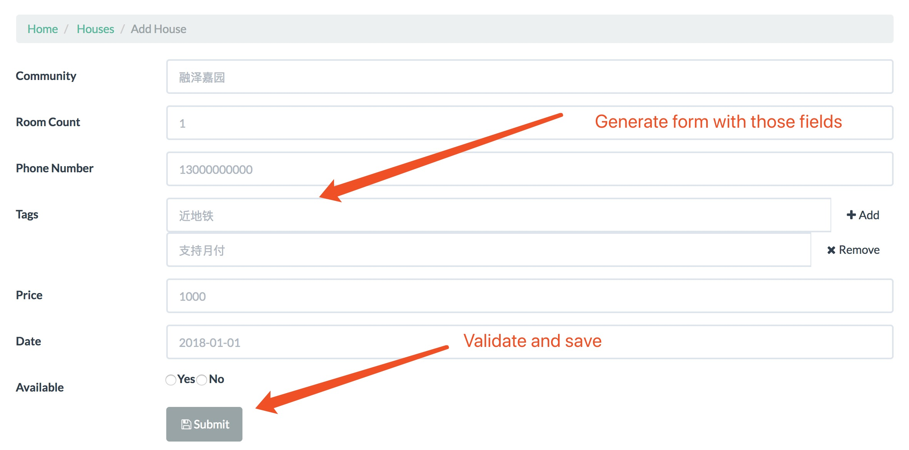
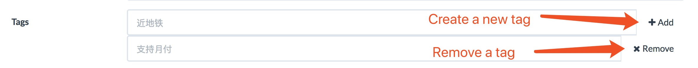
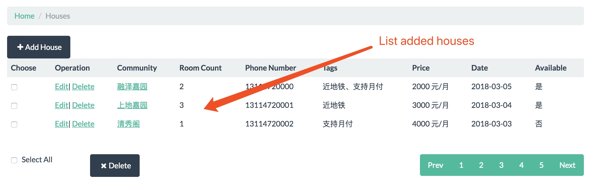
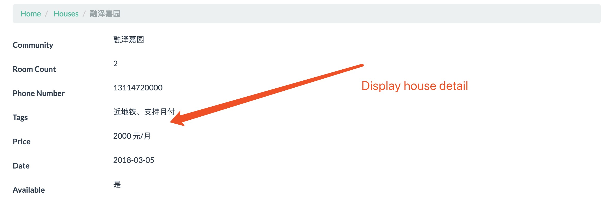
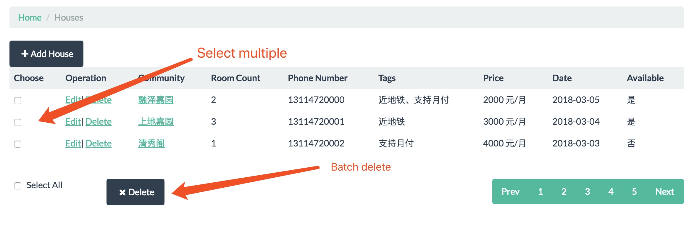

# House CRUD Test

## Overview

This test is for a simple Django CRUD views to add, edit and display Houses.

UI mockup is in [mock.html](house/templates/list.html).

Just implement as much functionality as you can in a time-box of 2 hours focusing fist on quality rather than quantity.

There're a lot of requirements so you're not expected to complete all of them, implement what you can and do it well,
And don't leave half implemented code and functionality, remove anything that's not completely finished in the final result.

At least the fist function (Add House) has to be implemented perfectly from every perspective (function, logic, code quality, tests, UX).

## Functionality to implement (in order of priority)

### 1. Add House view



It should be with languages as inline formset where languages can be added/removed in the list.



Fields:

* Community
    - Required
* Room Count
    - Required
    - Widget: horizontal radio buttons
* Phone number
    - Length: 11
    - Only numbers allowed
* Tags
    - Required: at least one tag should be added
    - Widget: Inline formset
* Price
    - Only numbers allowed, from 0 to 99999
* Date
    - Required
    - Widget: Datepicker
* Professional
    - Required
    - Widget: horizontal radio buttons

### 2. House List view



### 3. Edit House view

See Operation, same as add

### 4. House Detail view



### 5. Delete House

See Operation

### 6. Pagination


### 7. Batch Delete



## Project setup

1. Install dependencies:

```
pip install -r requirements.txt
```

2. Run django server:

```
./manage.py runserver
```

3. Open http://localhost:8000/ in a browser

## Good Luck!
